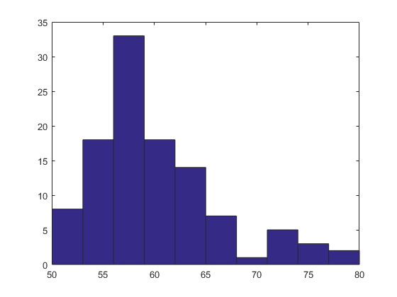

# MPRAGE-like validation
Some code to validate [MPRAGE-like](https://github.com/CyclotronResearchCentre/mprage-like) approach.

This code is linked to [poster #0406](https://hdl.handle.net/2268/338593) "MPRAGElike: a novel approach to generate T1w images from Multi-Contrast Gradient Echo images", presented at [OHBM2026](https://www.humanbrainmapping.org/OHBM2026/).

---

## COFITAGE data

Some preliminary results from the COFITAGE data.

Subjects `sub-070` and `sub-071` are excluded (for the moment) because of their mismatched orientation for the MPM data. This leaves 109 out of 111 subjects.

Estimated lambda values:

- mean & std: 60.311315 +/- 6.256927
- histogram:
  

Values of lambda to test and check the optimum: 

- below the mean 1, 30, 50, 
- at the mean 60
- above the mean 70, 100, 200, 400

This way we can assess the sensitivity to the value of lambda

- can we reproduce M-A Fortin's results on a different dataset ?
- can we use a mean value for the whole dataset or should stick to an individual optimum ?
